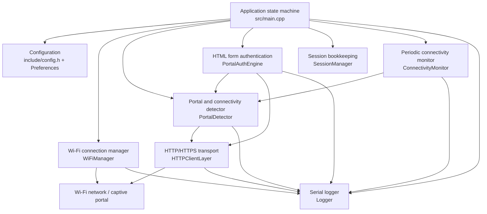

# ESP32 Captive Portal Login

An ESP32 Arduino prototype that connects to a configured Wi-Fi network, detects common captive-portal behavior, submits credentials to a standard HTML login form, and checks whether external connectivity is available.

> **Status: prototype.** The firmware compiles for the PlatformIO `esp32dev` environment, but has not been validated on an ESP32 or against the live GLA portal. A successful build does not demonstrate that a particular portal can be authenticated. Router/AP/NAT/DNS components are not integrated into the application.

## Contents

- [Capabilities and limitations](#capabilities-and-limitations)
- [High-level architecture](#high-level-architecture)
- [Repository layout](#repository-layout)
- [Requirements](#requirements)
- [Configure and build](#configure-and-build)
- [Validate on hardware](#validate-on-hardware)
- [Security](#security)
- [Recommended next steps](#recommended-next-steps)
- [Documentation](#documentation)

## Capabilities and limitations

### Current client-mode behavior

- Connects to a configured Wi-Fi SSID.
- Probes known external HTTP endpoints for redirects or expected connectivity responses.
- Uses a discovered redirect URL or configured portal URL to fetch the login page.
- Parses common HTML `<form>` and `<input>` attributes, including hidden fields.
- Submits form data using GET or POST.
- Verifies login by checking external connectivity rather than trusting generic success text.
- Rechecks connectivity on a configurable interval (60 seconds by default).

### Not currently supported or verified

- JavaScript-driven forms, browser challenges, multi-step login, and portal-specific APIs.
- Every CSRF/session-token scheme, form control type, or portal redirect pattern.
- Independent detection of portal session expiration.
- Automatic configuration by serial commands or a web interface.
- Router mode: AP/NAT/DNS source files exist, but the main application does not initialize them.
- Live GLA login, hardware upload, reliability, throughput, or extended soak testing.

Portal behavior differs between networks and may change over time. Inspect the live portal and test with the intended account and hardware before relying on this firmware.

## High-level architecture



### Startup and runtime flow

1. `main.cpp` initializes serial logging and loads settings from ESP32 Preferences, falling back to compile-time values in `include/config.h`.
2. `WiFiManager` joins the configured Wi-Fi network.
3. `PortalDetector` checks external connectivity. If it cannot verify access, the application attempts the configured portal login flow.
4. `PortalAuthEngine` fetches the login page, parses a supported standard HTML form, submits the credentials, and asks `PortalDetector` to verify connectivity.
5. On verified access, `ConnectivityMonitor` periodically checks connectivity and the state machine retries authentication after a failed check.

`HTTPClientLayer` handles HTTP/HTTPS requests, headers, cookies, timeouts, and bounded response reads. `SessionManager` stores session bookkeeping; it does not independently establish whether the remote portal session remains valid.

## Repository layout

```text
esp32-gla-wifi-autologin/
├── include/       Component interfaces, configuration types, config template
├── src/           Firmware implementation and application state machine
├── test/          PlatformIO Unity tests (require ESP32 hardware to execute)
├── docs/          Architecture and supporting project documents
├── scripts/       Build, upload, monitor, and test helper scripts
├── platformio.ini PlatformIO environments and ESP32 build options
├── README.md      Current setup, status, and limitations
└── GETTING_STARTED.md
```

Primary runtime components:

| Component | Responsibility |
|---|---|
| `WiFiManager` | Connects and reconnects the ESP32 station interface |
| `HTTPClientLayer` | Sends HTTP/HTTPS requests and handles response metadata |
| `PortalDetector` | Probes for captive-portal redirects and internet access |
| `PortalAuthEngine` | Parses a basic login form and submits its fields |
| `SessionManager` | Keeps local session state and elapsed-time bookkeeping |
| `ConnectivityMonitor` | Runs periodic connectivity checks |
| `CredentialStore` | Reads and writes settings in ESP32 Preferences |
| `Logger` | Writes leveled diagnostic messages to the serial console |

## Requirements

- ESP32 Dev Module or a compatible ESP32 board
- USB data cable and suitable USB-to-serial driver
- PlatformIO Core or the PlatformIO IDE extension for VS Code
- Authorized access to the target Wi-Fi network and captive portal

The PlatformIO project selects the ESP32 Arduino framework and its networking libraries.

## Configure and build

Run these commands from this project directory.

1. Copy `include/config.h.template` to `include/config.h`.
2. Set the network and portal values locally:

   ```cpp
   #define WIFI_SSID "your-network-name"
   #define WIFI_PASSWORD "your-wifi-password"
   #define PORTAL_URL "https://your-actual-login-page/"
   #define PORTAL_USER "your-portal-username"
   #define PORTAL_PASS "your-portal-password"
   ```

   The template portal URL is a placeholder/default, not confirmation of the current login endpoint. Verify the URL and form behavior on the live network. `include/config.h` is Git-ignored; do not commit it.

3. Compile the firmware:

   ```sh
   pio run
   ```

4. With the ESP32 connected, upload and monitor:

   ```sh
   pio run --target upload
   pio device monitor
   ```

The default PlatformIO environment is `esp32dev`. Adjust the board and upload settings in `platformio.ini` for a different device. To compile the test firmware:

```sh
pio test -e esp32dev_test
```

The Unity test suites execute on a connected ESP32 and serial port; `--without-uploading` does not make them host-only tests.

## Validate on hardware

Before treating the project as usable on a specific network:

- Record the login page URL, form method/action, input names, hidden fields, cookies, and redirects using the browser's developer tools. Do not share credentials or session cookies.
- Confirm the page is a standard HTML form and compare its fields with the supported parser behavior.
- Test successful and unsuccessful credentials; confirm a failed login is not mistaken for internet access.
- Test Wi-Fi loss/recovery, portal/session expiry, and connectivity-check behavior.
- Run an extended stability test and record board, firmware version, network conditions, and results.

Keep a sanitized example of the portal form structure (with all personal and session data removed) if repeatable parser tests are needed.

## Security

- **TLS verification is disabled by default.** `HTTPClientLayer` uses `setInsecure()` unless validation is changed in code. This makes HTTPS vulnerable to man-in-the-middle attacks on untrusted networks. Add and validate a trusted CA certificate before using sensitive credentials.
- **Credentials are compiled into the firmware** when supplied through `include/config.h`. Protect source code, build output, and device access.
- **Preferences/NVS is not encrypted by this application.** Configure ESP32 flash/NVS encryption separately if protection at rest is required.
- Avoid logging secrets, passwords, full authentication request bodies, or session cookies.
- Use this software only on networks and accounts for which you are authorized.

## Recommended next steps

For a reliable, maintainable project, prioritize:

1. **Portal fixtures and parser tests:** Add sanitized sample login pages for case/quote variations, relative actions, hidden CSRF values, multiple forms, and malformed HTML. Test generated requests without real credentials.
2. **Portal-specific configuration:** Support explicit username/password field names, endpoint, and any portal-specific parameters instead of relying only on inference.
3. **Authentication state correctness:** Verify cookies/redirect flow and distinguish invalid credentials, server errors, timeout, and unverified internet access.
4. **Recovery policy:** Use capped backoff and a clear state transition policy for Wi-Fi loss, portal failure, and repeated connectivity failure.
5. **TLS and credential protection:** Implement certificate validation, avoid embedding real credentials in distributable builds, and document platform encryption setup.
6. **Hardware CI/release checks:** Build for the supported board, compile tests, execute tests on hardware, and publish measured results separately from estimates.
7. **Router mode decision:** Either integrate and validate AP/NAT/DNS with an explicit test plan, or remove/disable those components and related claims until the feature is supported.
8. **Project hygiene:** Add a license, contribution guidance, version/release policy, and a sanitized portal test fixture policy.

## Documentation

- [Getting started](GETTING_STARTED.md)
- [Architecture details](docs/ARCHITECTURE.md)
- [API reference draft](docs/API_REFERENCE.md)
- [User guide draft](docs/USER_GUIDE.md)

Some documents under `docs/` are historical or research drafts. Treat measurements and feature claims in those documents as unverified unless accompanied by reproducible test data.

